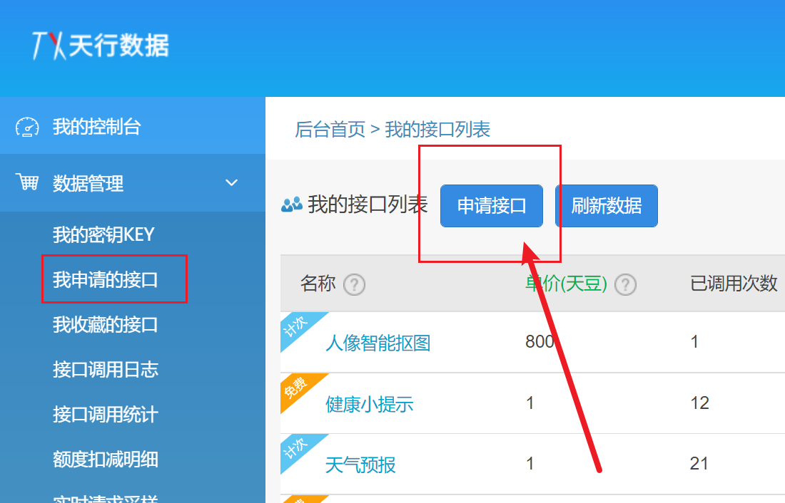
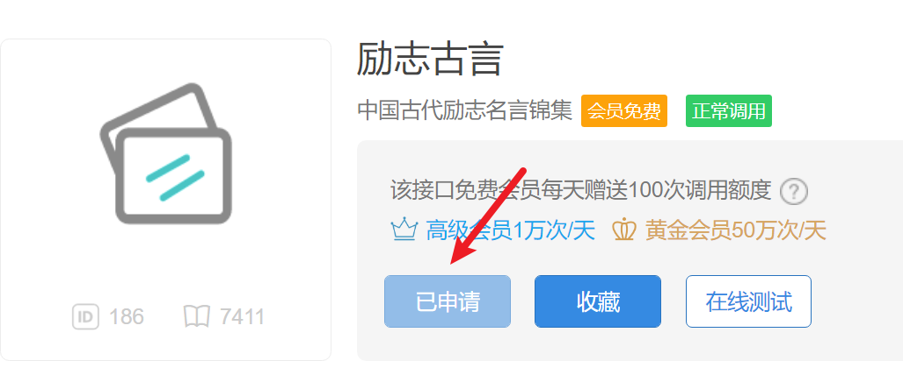
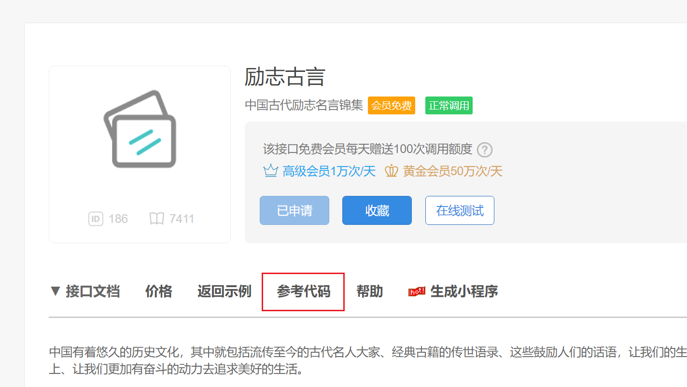
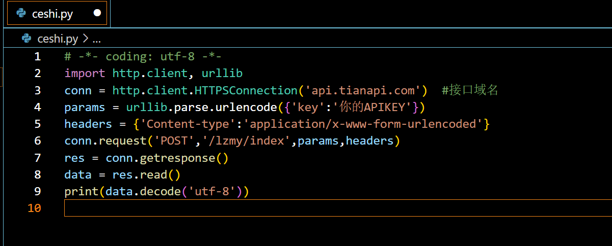
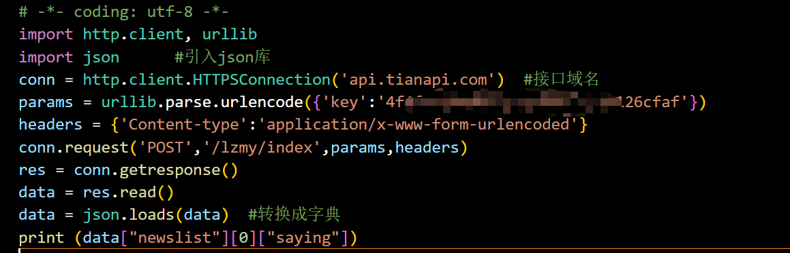
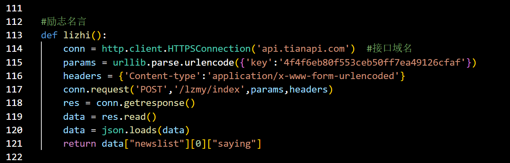

# 微信推送教程（对接api拓展）

**###注：该教程由小红书老哥@猪咪不是猪 改编而来，适合有一定编程基础的人，完全小白实现困难。**

主要目的是读懂源码，并进行一定的api拓展和服务器定时任务

## 前置条件

注册一个微信公众号

https://mp.weixin.qq.com/debug/cgi-bin/sandbox?t=sandbox/login 

扫码登录成功后，就可以生成微信公众测试号的appID和appsecret
扫描测试号二维码后会生成微信号，那个账号需要接收就扫码

## 新增测试模板
模板标题: 自定义，例如: 宝宝，晚上好!  
模板内容参考:  

**这是我使用的模板为了满足女朋友的考研需求，还是直接使用birthday1这个变量，在config.txt里面记得要用到的日期数据名称与这里对应，比如你要用到第一个日期，就在config.txt中的birthday1里面填进去，如果你要用到第二个日期，就填上birthday2，同时在模板里面也要增加{{birthday2.DATA}}**

```

{{date.DATA}} 
城市：{{city.DATA}} 
天气：{{weather.DATA}} 
最低气温: {{min_temperature.DATA}} 
最高气温: {{max_temperature.DATA}}
降雨概率：{{pop.DATA}}%
今日建议：{{tips.DATA}}
今天是我们恋爱的第{{love_day.DATA}}天 
距离蒋蒋考研还有{{birthday1.DATA}}天 

寄言：
{{lizhi.DATA}} 

{{pipi.DATA}}
```
## 安装python3 

官方网站: https://www.python.org/getit/

**记住在安装后需要配置系统环境PATH,具体教程网上可搜**

## 安装requests包

打开cmd，执行以下命令
```commandline
pip3 install requests
```

## 修改配置文件
`app_id`: 测试号信息里的appID 

`app_secret`: 测试信息里的appsecret

`template_id`: 模板消息接口里的模板ID

`user`: 测试号里的用户微信号

`province`: 所在省份

`city`: 所在城市

`birthday`: 生日（birthday1，birthday2，birthday3分别代表三个可使用的日期，按需求使用，不需要用的话，在消息模板里面不添加就好啦）

`love_date`: 纪念日

## 对接api实现

这里我们使用天行API进行使用，下面以励志古言API进行举例，会了这一个，其他的都是一样的，可以实现更多功能。

> 打开天行API官网https://www.tianapi.com/，进行注册并且认证。



在控制台-数据管理-我申请的接口里面点击申请接口


搜索后选择励志古言，并且点击申请接口。

申请后如下图所示



这里我们点击右边的在线测试


**这里你会得到你的key，页面不要关，这个key很重要，记下来**

回到刚刚申请的那个页面，点击参考代码



选择python


把这串代码复制下来。然后进行测试。

**强烈建议先独立开一个.PY，测试参考代码没有问题后再放进main.py！！！**

这里我们用VS Code来新建一个ceshi.py，来调试这个api接口，想省时间的可以直接复制我后面给出的源码。

把这串参考代码复制进去



然后在第4行中把`你的APIKEY`替换成我们在前面申请的key，如下图所示


然后我们直接进行 Run Code，输出结果如下图所示


我们发现它确实成功请求到了励志古言，其最终包含翻译以及来源，并且还有很多我们不需要的东西，我们只需要名言就行了，也就是只要提取到"saying"的值就行了

由于api返回的格式为json格式，我们需要把它转换成字典格式，这里需要引用json库，在代码最前面加入 import json，并且加入一句`data = json.loads(data)`将它转换成字典格式，


然后我们提取"saying"，通过观察之前的输出结果，我们很容易发现，"saying"被放在一个字典里面，然后这个字典又被放在了列表里面，这个列表又被作为最外层字典键"newslist"的值。所以我们通过下标方式提取：

`data["newslist"][0]["saying"]`

如下图所示：



这次再运行Run Code，我们会发现它已经输出正常了：


这里我把源代码贴出来，你们加入自己的KEY，可以自行测试：

```
# -*- coding: utf-8 -*-
import http.client, urllib
import json      #引入json库
conn = http.client.HTTPSConnection('api.tianapi.com')  #接口域名
params = urllib.parse.urlencode({'key':'在这里填入你自己的KEY'})
headers = {'Content-type':'application/x-www-form-urlencoded'}
conn.request('POST','/lzmy/index',params,headers)
res = conn.getresponse()
data = res.read()
data = json.loads(data)  #转换成字典
print (data["newslist"][0]["saying"])
```

## 将对接好的api放入主程序

首先我们观察主程序main.py

发现有几个主要流程

1. 编写获取api的函数
2. 将函数返回值赋予给自定义变量
3. 将变量作为参数放进post

总体比较简单，我这里直接给出我编写的函数

```
def lizhi():
    conn = http.client.HTTPSConnection('api.tianapi.com')  #接口域名
    params = urllib.parse.urlencode({'key':'在这里填入你自己的KEY'})
    headers = {'Content-type':'application/x-www-form-urlencoded'}
    conn.request('POST','/lzmy/index',params,headers)
    res = conn.getresponse()
    data = res.read()
    data = json.loads(data)
    return data["newslist"][0]["saying"]
```

同时要记得在main.py开头位置引入我们需要的库

```
import http.client, urllib
import json
```

如图所示




然后拉到最底下，把返回值赋予给变量lizhi


同时记得把lizhi这个变量加入send_message这个函数里面。

然后我们找到推送消息这一行，也要把它加入send_message里面

我这里多了一些pipi,pop,tip，都不用管，这个是我自己加入的其他的api，你们只需要加入一个lizhi就好啦。加多了会报错，记得直接在末尾加上就好。

最后，我们找到打包post的函数


在这个位置，直接在最底下，仿照上面，加入一个lizhi


记得放在最后面的话，花括号后面不要逗号。

至此，api接入已经全部完成。

在保证消息模板中有{{lizhi.DATA}}，并且config.txt文件填写无误的情况下就可以运行了！

## 运行程序

```commandline
直接双击文件 main.py 即可
```

注：如果要在VS CODE中运行，需要先在vs code中打开相应的文件夹
