# 微信推送教程-呆瓜版教程！谁都会！-V 1.1

感谢大家支持，这次推出呆瓜版教程，几乎不需要编程基础就能操作并且对接api，只有挂在服务器上有一定门槛

作者:erwanjun

改编自:小红书@猪咪不是猪

## 如何下载文件

由于有很多小白朋友，不知道如何使用码云和Github，这里做简要介绍：

```
该项目的Github地址为：https://github.com/erwanjun/weixin_tuisong
该项目的码云地址为：https://gitee.com/erwanjun/weixin_tuisong
```

**Github下载文件方法**


点击`Code`，再点击 `Download ZIP`

**码云下载文件方法**


先点击`克隆/下载`，再点击`下载ZIP`

下载完成后在本地解压即可


新手只需要使用到呆瓜版

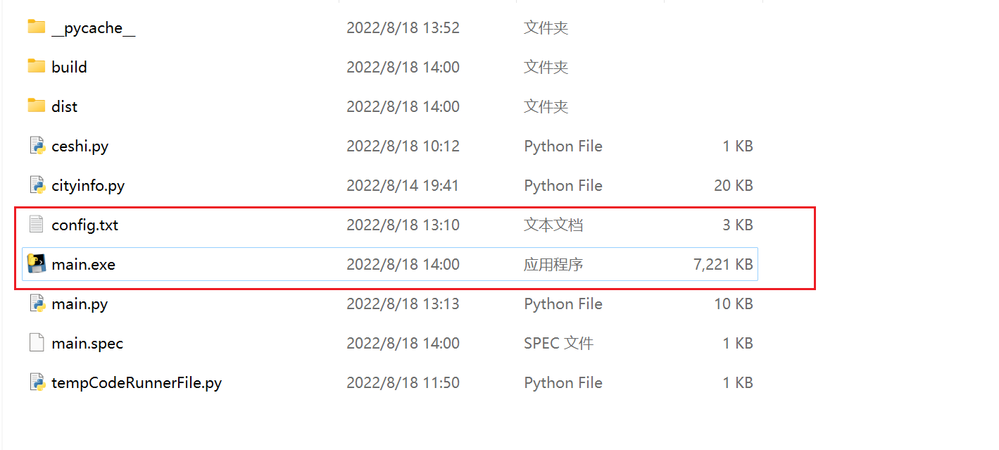

**呆瓜版只需要用到这两个文件！操作简便！**

前置条件

注册一个微信公众号，利用下面的链接注册一个微信公众测试号

`https://mp.weixin.qq.com/debug/cgi-bin/sandbox?t=sandbox/login` 

扫码登录成功后，就可以生成微信公众测试号的appID和appsecret这两串数字需要记住，后面会用到


扫描测试号二维码后会生成微信号，哪个账号需要接收推送信息就需要哪个账号扫码

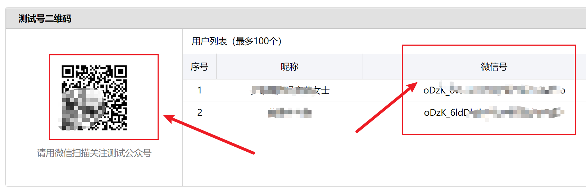

这里需要记住的是对应账号的微信号，也就是user id，后面需要用

## 新增测试模板


这里点击`新增测试模板`

模板标题: 自定义，例如: 亲爱的，早上好!  
模板内容参考:  

**在config.txt里面记得要用到的日期数据名称与这里对应，比如你要用到第一个日期，就在config.txt中的birthday1里面填进去，如果你要用到第二个日期，就填上birthday2，同时在模板里面也要增加{{birthday2.DATA}}**

```
{{date.DATA}} 
城市：{{city.DATA}} 
天气：{{weather.DATA}} 
最低气温: {{min_temperature.DATA}} 
最高气温: {{max_temperature.DATA}}
降雨概率：{{pop.DATA}}%
今日建议：{{tips.DATA}}
今天是我们恋爱的第{{love_day.DATA}}天 
距离小宝生日还有{{birthday1.DATA}}天 
距离我的生日还有{{birthday2.DATA}}天 
寄言：
{{lizhi.DATA}} 
{{note_en.DATA}} 
{{note_ch.DATA}} 
{{pipi.DATA}}
```

这个模板可以整个全部复制进去

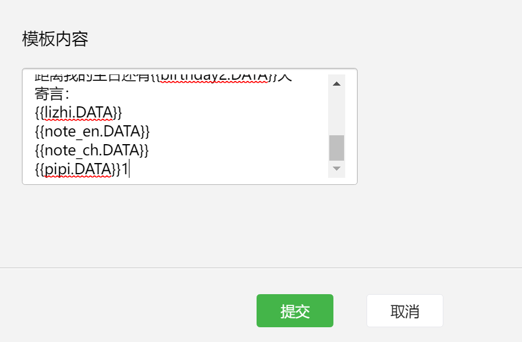

这里面的每一个{{***.DATA}}都对应相应的数据，需要就保留，不需要就删掉，不想理解这些东西就直接放在这里不用删除也可以

## 安装python3 

官方网站: https://www.python.org/getit/

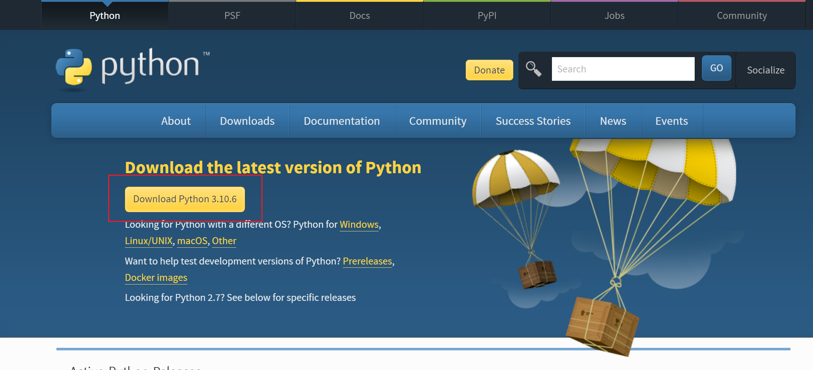

**记住在安装后需要配置系统环境PATH,具体教程网上可搜！！重要！**

## 安装requests包

打开cmd命令行，执行以下命令

```commandline
pip3 install requests
```

这里不做具体介绍，很简单，网上可以直接搜索到

## 修改配置文件

打开config.txt文件，这里建议不要用记事本，选择用Notepad++打开！

notepad++安装地址：https://notepad-plus-plus.org/downloads/

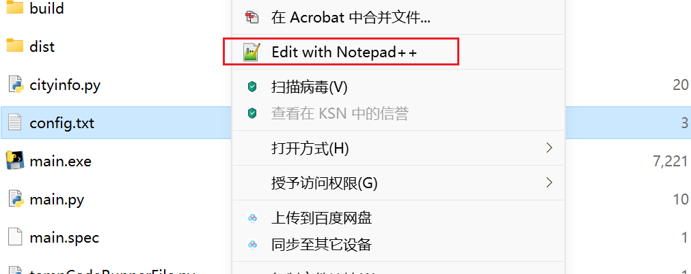

打开后如下图所示：

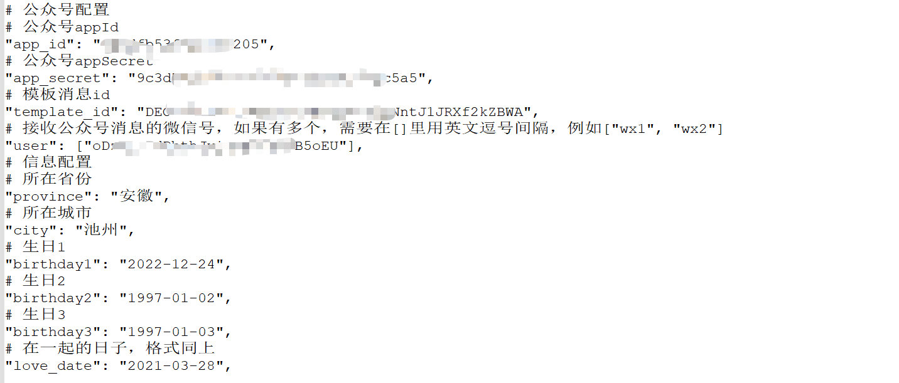

需要在对应的地方填入你刚刚申请到的这些东西

`app_id`: 测试号信息里的appID 

`app_secret`: 测试信息里的appsecret

`template_id`: 模板消息接口里的模板ID

`user`: 测试号里的用户微信号

`province`: 所在省份

`city`: 所在城市

`birthday`: 生日（birthday1，birthday2，birthday3分别代表三个可使用的日期，按需求使用，不需要用的话，在消息模板里面不添加就好啦）

`love_date`: 纪念日

**注意填入的时候不要删掉双引号！**

这个时候你双击main.exe文件，就已经能在微信收到消息了！如果想要更改，对照着更改消息模板和config.txt文件就好啦

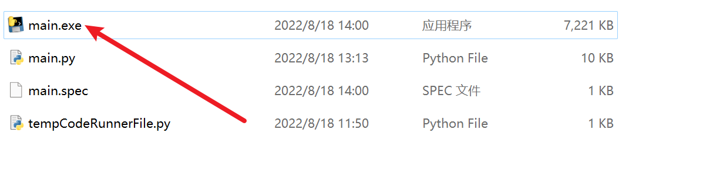


====================================================================================================**至此你已经学会了简单微信推送的办法，下面将教你如何使用其他的接口，来达到更多功能，仍然不涉及到代码**

=================================================================================================

## 对接api实现

这里我们使用天行API进行使用，下面以励志古言API进行举例，会了这一个，其他的都是一样的，可以实现更多功能。

> 打开天行API官网https://www.tianapi.com/，进行注册并且认证。


在控制台-数据管理-我申请的接口里面点击申请接口


搜索后选择励志古言，并且点击申请接口。

申请后如下图所示


记住一定要先点申请再测试！

这里我们点击右边的在线测试


**这里你会得到你的key，页面不要关，这个key很重要，记下来**

然后打开config.txt文件，然后

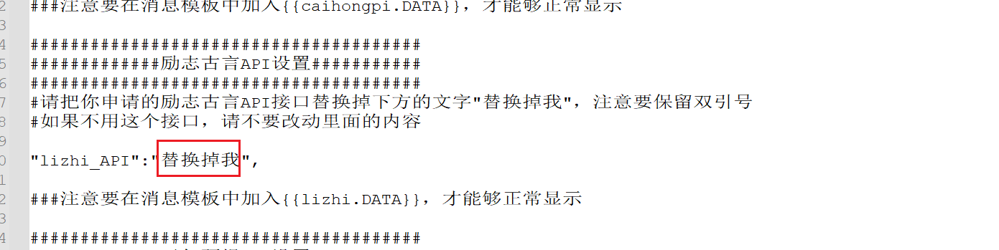

把`替换掉我`这四个字替换成key，并且保证消息模板中有{{lizhi.DATA}}，就可以了

这里支持可以申请的api地址在下方，都只要申请后把key填进config.txt就可以了

励志古言API地址：https://www.tianapi.com/apiview/186

彩虹屁API地址：https://www.tianapi.com/apiview/181

天气预报API地址：https://www.tianapi.com/apiview/72

都是填入之后，确保消息模板里面有对应的{{***.DATA}}

`直接运行main.exe就可以了！`

**想要挂到服务器上的同学，直接跳到后面-挂服务器教程**

# 源码版教程-适合有基础的同学改编拓展

**###注：源码版教程适合有一定编程基础的人，完全小白实现困难。**


接着申请API

回到刚刚申请的那个页面，点击参考代码


选择python


把这串代码复制下来。然后进行测试。

**强烈建议先独立开一个.PY，测试参考代码没有问题后再放进main.py！！！**

这里我们用VS Code来新建一个ceshi.py，来调试这个api接口，想省时间的可以直接复制我后面给出的源码。

把这串参考代码复制进去


然后在第4行中把`你的APIKEY`替换成我们在前面申请的key，如下图所示


然后我们直接进行 Run Code，输出结果如下图所示


我们发现它确实成功请求到了励志古言，其最终包含翻译以及来源，并且还有很多我们不需要的东西，我们只需要名言就行了，也就是只要提取到"saying"的值就行了

由于api返回的格式为json格式，我们需要把它转换成字典格式，这里需要引用json库，在代码最前面加入 import json，并且加入一句`data = json.loads(data)`将它转换成字典格式，


然后我们提取"saying"，通过观察之前的输出结果，我们很容易发现，"saying"被放在一个字典里面，然后这个字典又被放在了列表里面，这个列表又被作为最外层字典键"newslist"的值。所以我们通过下标方式提取：

`data["newslist"][0]["saying"]`

如下图所示：


这次再运行Run Code，我们会发现它已经输出正常了：


这里我把源代码贴出来，你们加入自己的KEY，可以自行测试：

```
# -*- coding: utf-8 -*-
import http.client, urllib
import json      #引入json库
conn = http.client.HTTPSConnection('api.tianapi.com')  #接口域名
params = urllib.parse.urlencode({'key':'在这里填入你自己的KEY'})
headers = {'Content-type':'application/x-www-form-urlencoded'}
conn.request('POST','/lzmy/index',params,headers)
res = conn.getresponse()
data = res.read()
data = json.loads(data)  #转换成字典
print (data["newslist"][0]["saying"])
```

## 将对接好的api放入主程序

首先我们观察主程序main.py

发现有几个主要流程

1. 编写获取api的函数
2. 将函数返回值赋予给自定义变量
3. 将变量作为参数放进post

总体比较简单，我这里直接给出我编写的函数

```
def lizhi():
    conn = http.client.HTTPSConnection('api.tianapi.com')  #接口域名
    params = urllib.parse.urlencode({'key':'在这里填入你自己的KEY'})
    headers = {'Content-type':'application/x-www-form-urlencoded'}
    conn.request('POST','/lzmy/index',params,headers)
    res = conn.getresponse()
    data = res.read()
    data = json.loads(data)
    return data["newslist"][0]["saying"]
```

同时要记得在main.py开头位置引入我们需要的库

```
import http.client, urllib
import json
```

如图所示


然后拉到最底下，把返回值赋予给变量lizhi


同时记得把lizhi这个变量加入send_message这个函数里面。

然后我们找到推送消息这一行，也要把它加入send_message里面

我这里多了一些pipi,pop,tip，都不用管，这个是我自己加入的其他的api，你们只需要加入一个lizhi就好啦。加多了会报错，记得直接在末尾加上就好。

最后，我们找到打包post的函数


在这个位置，直接在最底下，仿照上面，加入一个lizhi


记得放在最后面的话，花括号后面不要逗号。

至此，api接入已经全部完成。

在保证消息模板中有{{lizhi.DATA}}，并且config.txt文件填写无误的情况下就可以运行了！

## 运行程序

```commandline
直接双击文件 main.py 即可
```

注：如果要在VS CODE中运行，需要先在vs code中打开相应的文件夹

# 挂服务器（家用电脑也可以）自动任务教程

注意：没有服务器的话，用家用电脑也可以，但是在电脑关机的情况下，无法进行自动任务。

## 首先你需要一台云服务器

`我自己用的是腾讯云服务器，购买地址为:https://cloud.tencent.com/`

购买之后安装系统镜像，我这里选择的是Windows servers 2012 R2

刚开始安装系统会要求你设置VNC登录密码，如果忘记了需要重置密码


在购买成功服务器的同时你还会获得一个公网ip


安装好后首先要做的事情是用自己的电脑连接上服务器

## 连接服务器

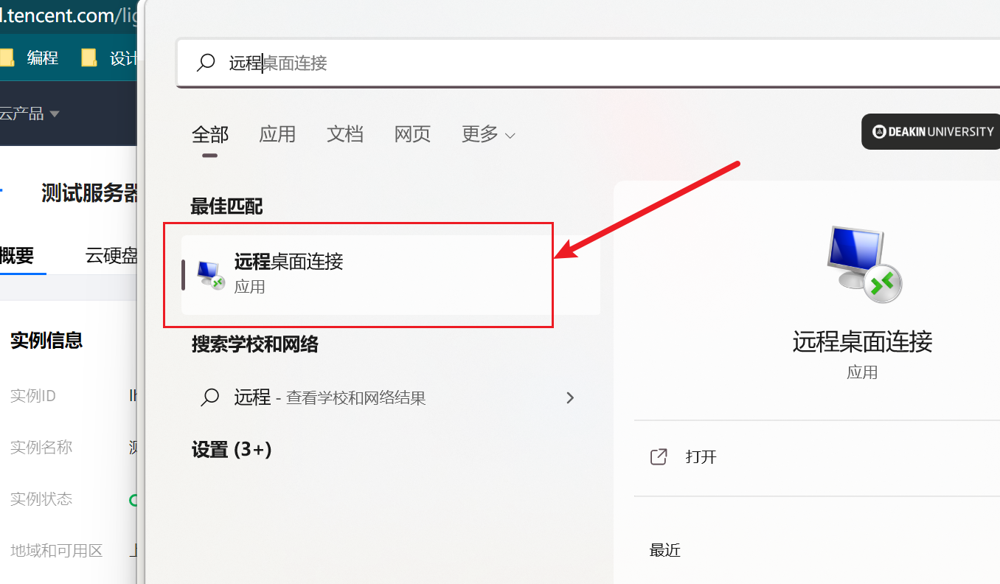

直接在自己的电脑上搜索远程电脑连接工具

然后计算机栏填你刚刚申请的公网ip；

用户名填**Administrator**

密码填你刚刚在VNC设置的密码

填好后就能登录我们的服务器拉

## 安装python

在你的远程服务器上也需要安装python和request包还有配置系统变量，可以直接在服务器中打开浏览器安装，和在自己电脑上操作一模一样

官方网站: https://www.python.org/getit/

**记住在安装后需要配置系统环境PATH,具体教程网上可搜**

## 安装requests包

打开cmd，执行以下命令

```commandline
pip3 install requests
```

## 设置定时任务

你可以直接把你电脑里面的代码文件夹都复制进去，因为windows定时任务不能直接执行.py文件，所以我们需要创建一个.bat文件，首先我们要在服务器上创建一个文本文件（记得要放在与main.py同一个文件夹里面），在里面输入

`python main.py`

(通过呆瓜版完成的同学可以直接使用main.exe，不用创建.bat)

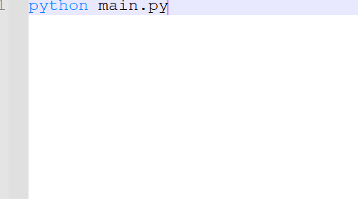

然后进行重命名，我这里重命名为run.bat文件。该文件已经同步上传github和码云，可以直接下载。


然后我们就可以开心的设置定时任务啦！

在服务器上搜索`任务计划程序`

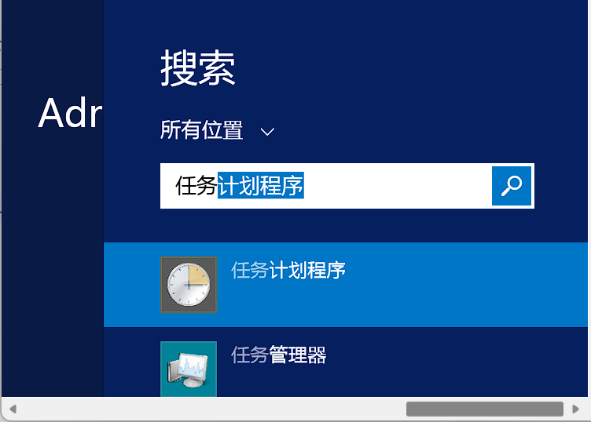

点击`创建基本任务`


名称就直接填`微信推送`就行

点击`下一步`，选择`每天`

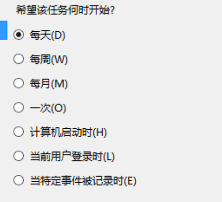

这里填你每天想要推送的时间，我这里选的是早上七点四十

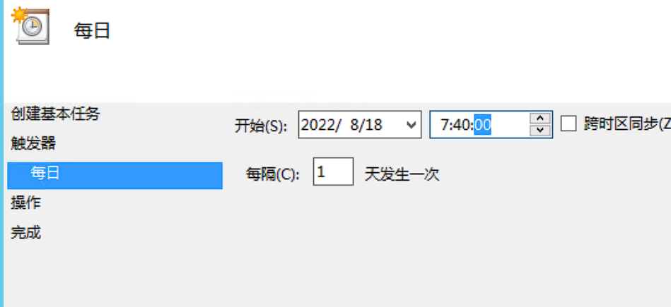

选择`启动程序`

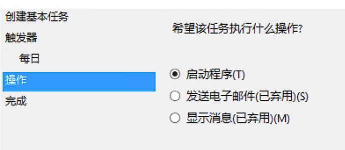

然后在`程序或脚本`这里填入你运行代码的run.bat文件

记住`起始于`也要填，填你放run.bat的文件夹

文件夹地址可以直接复制

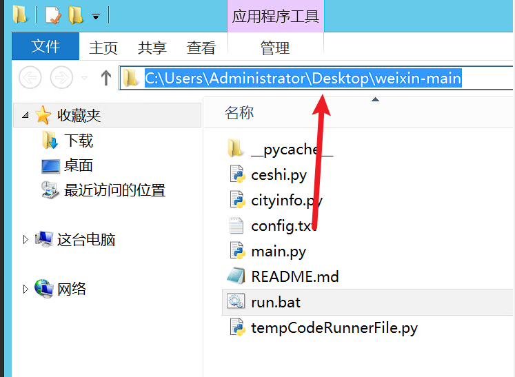

这一步完成后直接点击完成

但是还没有完，我们还需要设置启动程序权限

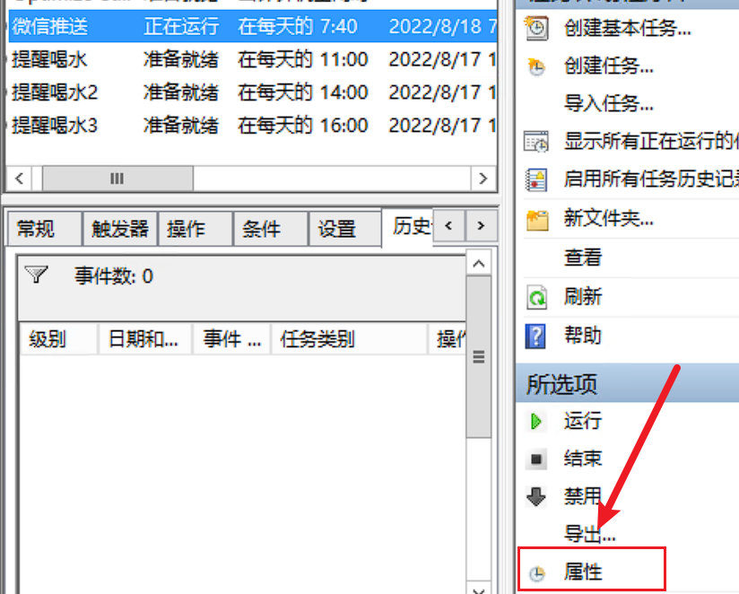

点击刚刚创建任务的属性

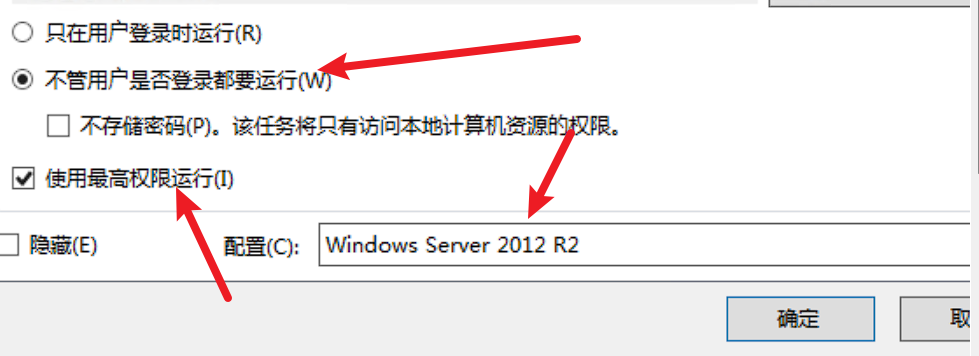

勾选`不管用户是否登录都要运行`和`使用最高权限运行`，配置选择你的服务器配置（用电脑的选用自己电脑配置）

全部完成后点击确定，然后输入VNC密码就可以啦！

全部完成~
