# 微信推送教程-呆瓜版教程！谁都会！-V 1.3

感谢大家支持，这次推出呆瓜版教程，几乎不需要编程基础就能操作并且对接api，只有挂在服务器上有一定门槛

作者:erwanjun

改编自:小红书@猪咪不是猪

# 一、呆瓜版究极教程

## **1.1 更新日志：**

====================================================

版本：V 1.3     更新日期：2022年8月22日

重大更新：

更新GUI图形界面，无需打开文件编辑器

使用json代替txt文件，减少容错率

优化代码逻辑

~~增加腾讯云函数教程~~

====================================================

版本：V 1.2     更新日期：2022年8月20日

更新内容：

支持使用农历日期（具体请查看config.txt）

支持新api：

`星座运势api`

`健康小提示api`

链接已经附在后面

====================================================

此次更新源于小红书**@咕噜咕噜**的定制需求，感谢该同学的支持

====================================================

## **1.2 如何下载文件**

由于有很多小白朋友，不知道如何使用码云和Github，这里做简要介绍：

```
该项目的Github地址为：https://github.com/erwanjun/weixin_tuisong
该项目的码云地址为：https://gitee.com/erwanjun/weixin_tuisong
```

**Github下载文件方法**

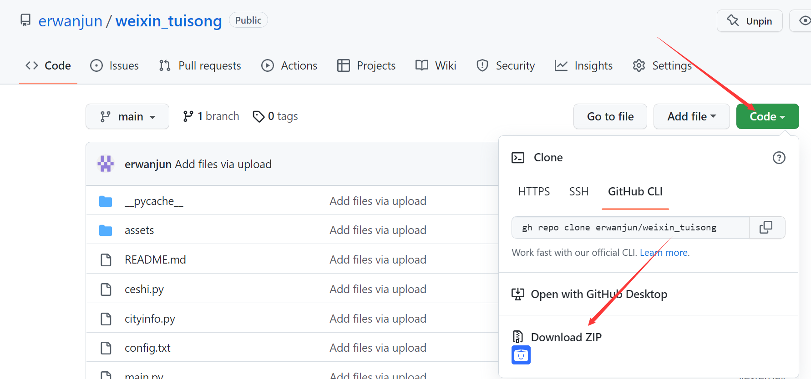

点击`Code`，再点击 `Download ZIP`

**码云下载文件方法**

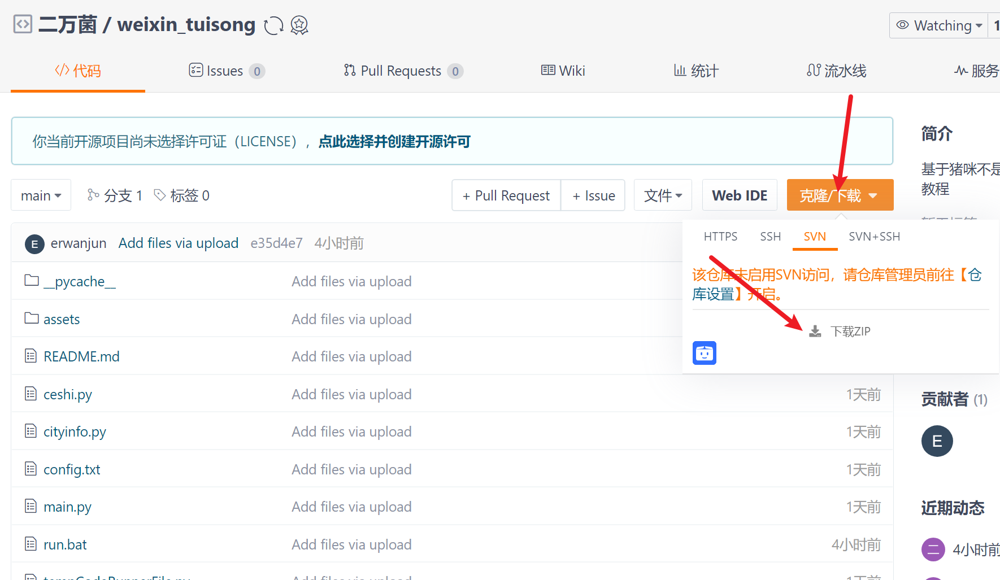

先点击`克隆/下载`，再点击`下载ZIP`

下载完成后在本地解压即可

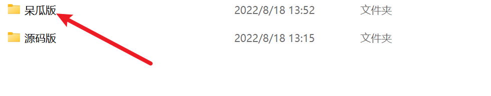

新手只需要使用到呆瓜版

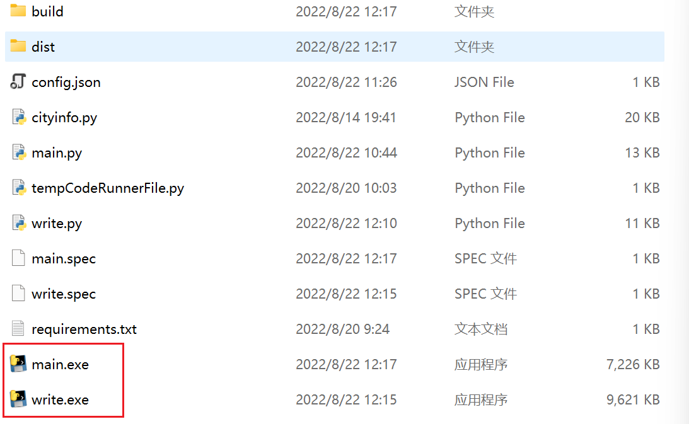


**呆瓜版只需要用到这两个文件！操作简便！**

前置条件

注册一个微信公众号，利用下面的链接注册一个微信公众测试号

`https://mp.weixin.qq.com/debug/cgi-bin/sandbox?t=sandbox/login` 

扫码登录成功后，就可以生成微信公众测试号的appID和appsecret这两串数字需要记住，后面会用到

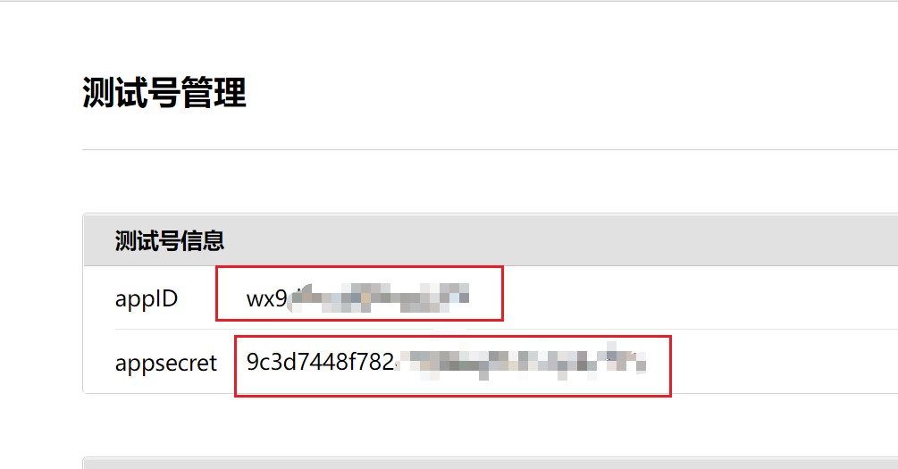

扫描测试号二维码后会生成微信号，哪个账号需要接收推送信息就需要哪个账号扫码


这里需要记住的是对应账号的微信号，也就是user id，后面需要用

## 1.3 新增测试模板

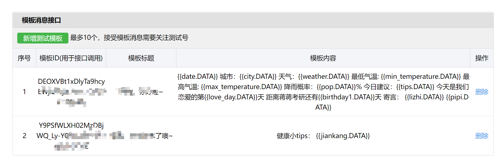

这里点击`新增测试模板`

模板标题: 自定义，例如: 亲爱的，早上好!  
模板内容参考:  

**在config.txt里面记得要用到的日期数据名称与这里对应，比如你要用到第一个日期，就在config.txt中的birthday1里面填进去，如果你要用到第二个日期，就填上birthday2，同时在模板里面也要增加{{birthday2.DATA}}**

```
{{date.DATA}} 
城市：{{city.DATA}} 
天气：{{weather.DATA}} 
最低气温: {{min_temperature.DATA}} 
最高气温: {{max_temperature.DATA}}
降雨概率：{{pop.DATA}}%
今日建议：{{tips.DATA}}
今天是我们恋爱的第{{love_day.DATA}}天 
距离小宝生日还有{{birthday1.DATA}}天 
距离我的生日还有{{birthday2.DATA}}天 
寄言：
{{lizhi.DATA}} 
{{note_en.DATA}} 
{{note_ch.DATA}} 
{{pipi.DATA}}
```

这里面的每一个{{***.DATA}}都对应相应的数据，需要就保留，不需要就删掉，不想理解这些东西就直接放在这里不用删除也可以

不会用的同学可以直接复制上面这个模板，然后点击`提交`按钮


```
模板说明：
每个变量的含义如下所示，
{{date.DATA}}                  当天日期
{{city.DATA}}                  你所在的城市
{{weather.DATA}}               你所在城市的天气
{{min_temperature.DATA}}       你所在城市当天的最低气温
{{max_temperature.DATA}}       你所在城市当天的最高气温
{{pop.DATA}}                   你所在城市今天的降雨概率（需要API）
{{tips.DATA}}                  针对你所在城市的天气提出的建议（需要API）
{{love_day.DATA}}              你和对象在一起一共多少天了
{{birthday1.DATA}}             距离你对象的生日还有多少天
{{birthday2.DATA}}             距离你的生日还有多少天
{{lizhi.DATA}}                 随机出现一句励志古言（需要API）
{{note_en.DATA}}               词霸每日一句的英语
{{note_ch.DATA}}               词霸每日一句的中文
{{pipi.DATA}}                  一句彩虹屁（需要API）
可以自行添加的变量： 
{{health.DATA}}                一句健康小提示（需要API）
{{lucky.DATA}}                 今天的星座运势（需要API）
```

`注：没有申请API的同学不要慌，后面会教大家怎么申请`

这个模板可以整个全部复制进去


## 1.4 对接api实现

这里我们使用天行API进行使用，下面以励志古言API进行举例，会了这一个，其他的都是一样的，可以实现更多功能。

> 打开天行API官网https://www.tianapi.com/，进行注册并且认证。


在控制台-数据管理-我申请的接口里面点击申请接口

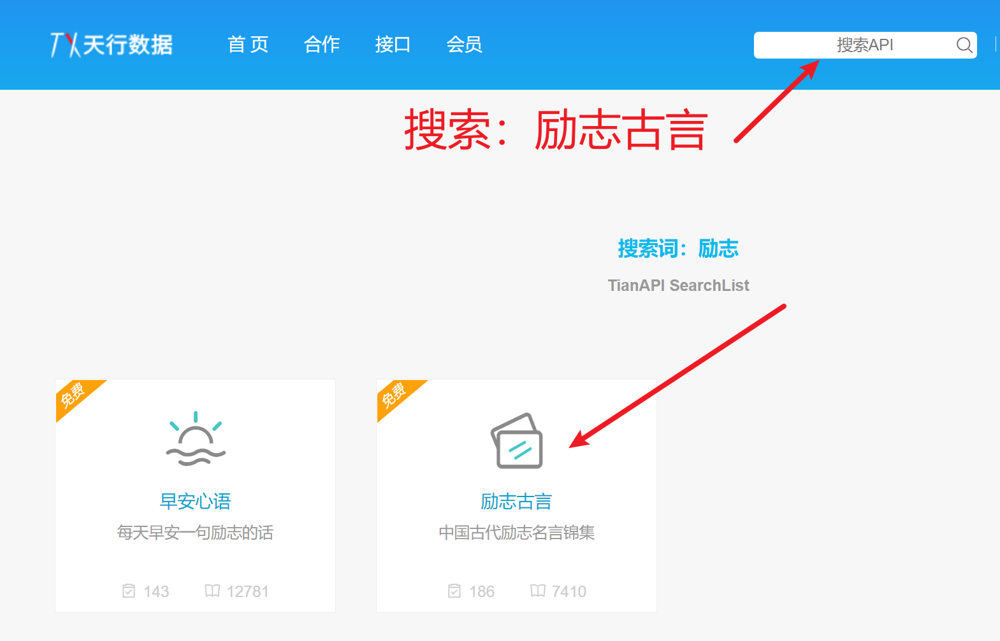

搜索后选择励志古言，并且点击申请接口。

申请后如下图所示


记住一定要先点申请再测试！

这里我们点击右边的在线测试


**这里你会得到你的key，页面不要关，这个key很重要，记下来**

## 1.5 修改配置文件

双击write.exe文件，打开配置文件写入小工具

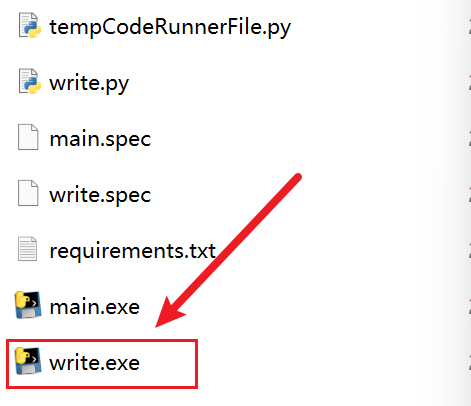

等待一下后会看到一个图形界面


在里面填入你的所有信息，右边有相应的参考格式，不要直接复制右边的，`目前没有申请天行API的这一行先空着！！！`然后点击`确定`

点击`确定`后，


**勾选你想用的天行API，没有申请的不要勾选！！只勾选你申请了的！！**

选完了后

直接点击`选好了`

`直接运行main.exe就可以了！`

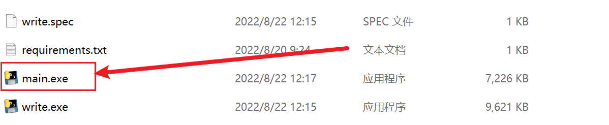

```
这里支持可以申请的api地址在下方，都只要申请后把key填进config.txt就可以了

励志古言API地址：https://www.tianapi.com/apiview/186

彩虹屁API地址：https://www.tianapi.com/apiview/181

天气预报API地址：https://www.tianapi.com/apiview/72

星座运势API地址：https://www.tianapi.com/apiview/78

健康小提示API地址：https://www.tianapi.com/apiview/122

都是填入之后，确保消息模板里面有对应的{{***.DATA}}
```

# 二、使用 Github 实现自动推送

## 2.1 建立新的仓库

由于Github在国内访问效果并不好，并且有相当一部分同学没有相应的网络环境，所以建议使用加速器来进行访问，

这里建议使用steam++来进行访问，微软软件商店可以下载，名字为：Watt Toolkit


需要先选中Github，再选中点击一键加速进行加速，然后我们登录Github网站


在储存库里面点击`New`，来新建一个库


在`Repository name`里面随便填个什么，我这里填的是time-push，然后下面选择`Public`

然后点击`Create repository`


至此，你已经创建了一个仓库了

## 2.2 实现自动推送


在仓库页面点击`Actions`

然后选择`Simple workflow`

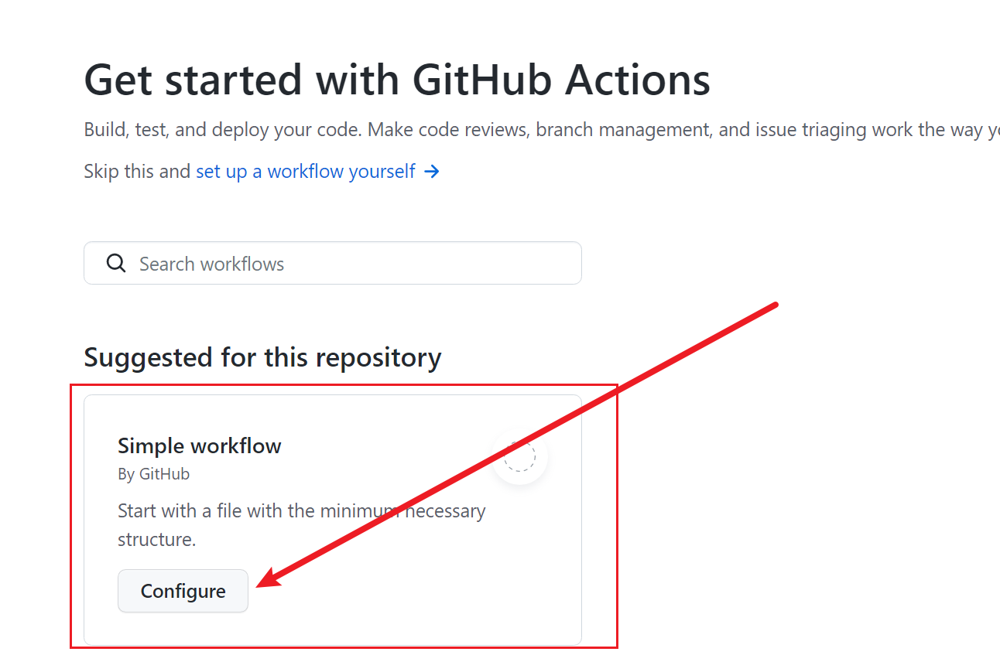

点击`Configure`

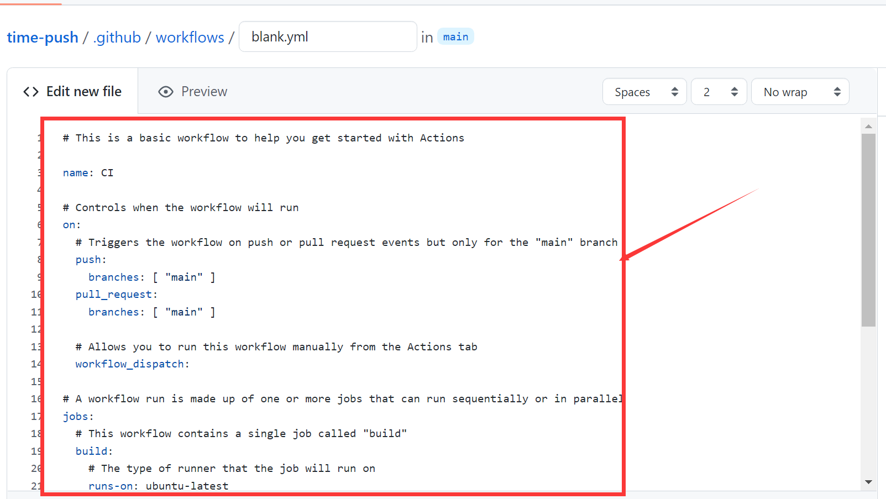

把这个部分全部删除，替换成以下内容

```
<<<<<<< HEAD
name: time-push
on:
  workflow_dispatch:
  schedule: 
    # 代表国际标准时间4点0分，北京时间需要+8小时，代表北京时间中午12点运行
    - cron: '0 4 * * *'
jobs:
#将工作流程中运行的所有作业组合在一起
  build:
  #定义名为 build 的作业。 子键将定义作业的属性 
    runs-on: ubuntu-latest 
    steps:
      - uses: actions/checkout@v2
    
      - name: Set up Python 3.9
        uses: actions/setup-python@v2
        with:
          python-version: 3.9.1
      - name: Set timezone
        run: |
          cp /usr/share/zoneinfo/Asia/Shanghai /etc/localtime
      - name: install pip packages
        run: |
          python -m pip install --upgrade pip
          pip3 install -r requirements.txt
      - name: time-push
        run: |
          python3 main.py
=======
name: run 
 on: 
 workflow_dispatch: 
 schedule:  
 # 代表国际标准时间4点0分，北京时间需要+8小时，代表北京时间中午12点运行 
 - cron: '0 21 * * *' 
 jobs: 
 #将工作流程中运行的所有作业组合在一起 
 build: 
 #定义名为 build 的作业。 子键将定义作业的属性  
 runs-on: ubuntu-latest  
 steps: 
 - uses: actions/checkout@v2 
   - name: Set up Python 3.9 
 uses: actions/setup-python@v2 
 with: 
 python-version: 3.9.1 
 - name: install pip packages 
 run: | 
 python -m pip install --upgrade pip 
 pip3 install -r requirements.txt 
 - name: 你的目录名称 
 run: | 
 python ./main.py 
>>>>>>> main
```

其中倒数第三行这里的`name:`后面填写你在2.1中创建的这个仓库的名字，我这里就填写`time-push`

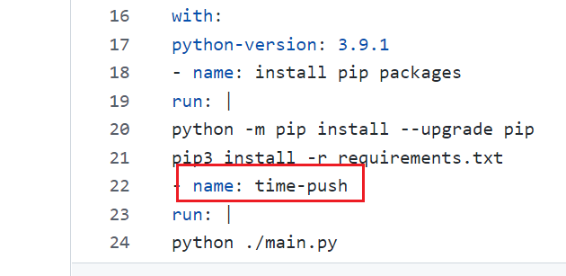

完成后点击`Start commit`提交


这里可以随便写


然后我们点击仓库名称回到主界面


点击`Add file`按钮

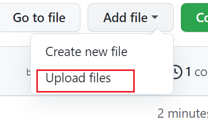

选择`Upload files`

点击`Choose your files`


这里以呆瓜版举例，需要上传 `cityinfo.py` `config.json` `main.py` `requirements.txt`四个文件

注意需要是你已经在第一章里面已经测试成功推送后的文件，报错的就不要上传了


点击`Commit changes`


然后看到仓库里面文件都有了就成功了


**<u>第三部分暂不可用，后面解决问题后会再补充</u>**

# ~~三、使用腾讯云函数实现自动推送（暂不可用）~~

~~**想要挂到服务器上的同学，直接跳到后面-挂服务器教程**~~

~~由于腾讯云函数安全稳定，能够实现自动推送，并且三个月免费，对不能使用Github的同学来说是一种比较优秀的解决方案。~~

~~登录腾讯云函数官网：https://cloud.tencent.com/product/scf~~

## ~~2.1 开通使用腾讯云函数~~

~~点击登录：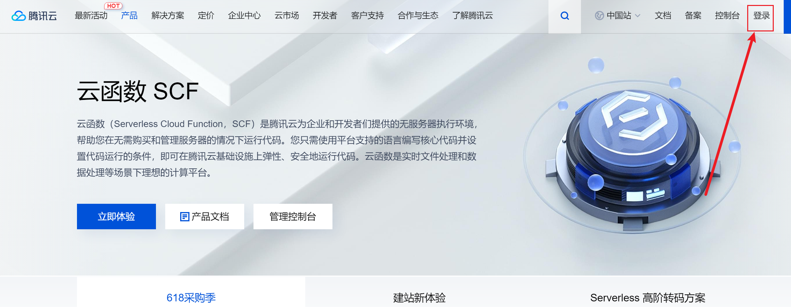~~

~~登录成功后点击立即体验~~

~~~~

~~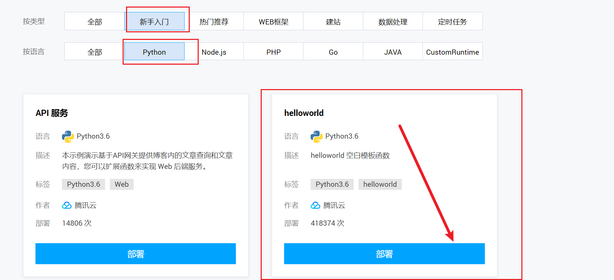~~

~~点击后，不要继续！直接返回！更简单不易出错！~~

~~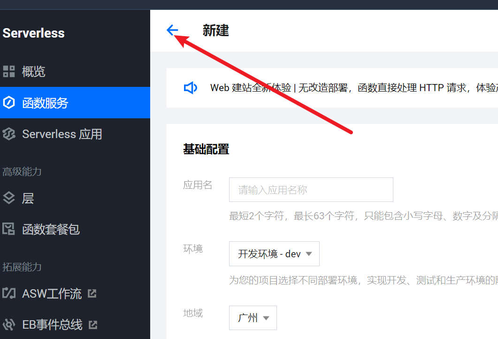~~

~~然后点击新建~~

~~~~

## ~~2.2 新建云函数~~

~~~~

~~照着我的填就行，函数名称你也可以自己取~~

~~~~

~~![(assets/image-20220822142606907.png)~~

~~选择`本地上传文件夹`~~

~~执行方法填`main.send_message`~~

~~~~

~~上传选择你的呆瓜版文件夹~~

~~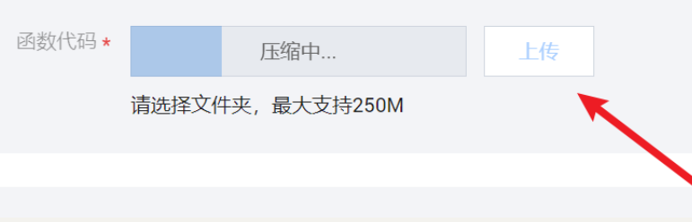~~

~~然后`触发器配置`点开小三角形，选择`自定义创建`~~

~~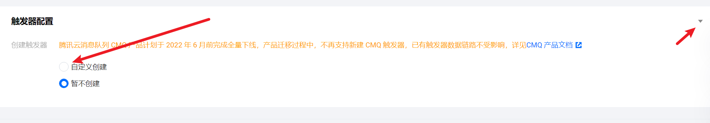~~

~~~~

~~选择自定义触发周期~~

~~`Cron表达式` 填入 `0 0 8 * * * * `，这个的意思是每天早上八点发送，~~

~~想实现其他时间推送，看这个文档：https://cloud.tencent.com/document/product/583/9708#cron-.E8.A1.A8.E8.BE.BE.E5.BC.8F~~

~~~~

~~我们点击 函数管理~~

~~~~

~~然后我们点击终端~~

~~~~

~~在下方输入 `pip install -r requirements.txt -t . `~~

~~~~

~~然后等待完成~~

~~等待压缩上传~~


# 四、源码版教程-适合有基础的同学改编拓展

**###注：源码版教程适合有一定编程基础的人，完全小白实现困难。**

源码版教程需要提前安装下面两项

## 3.1 安装python3 

官方网站: https://www.python.org/getit/


**记住在安装后需要配置系统环境PATH,具体教程网上可搜！！重要！**

## 3.2 安装requests包

打开cmd命令行，执行以下命令

```commandline
pip3 install requests
```

这里不做具体介绍，很简单，网上可以直接搜索到

接着申请API

回到刚刚申请的那个页面，点击参考代码


选择python

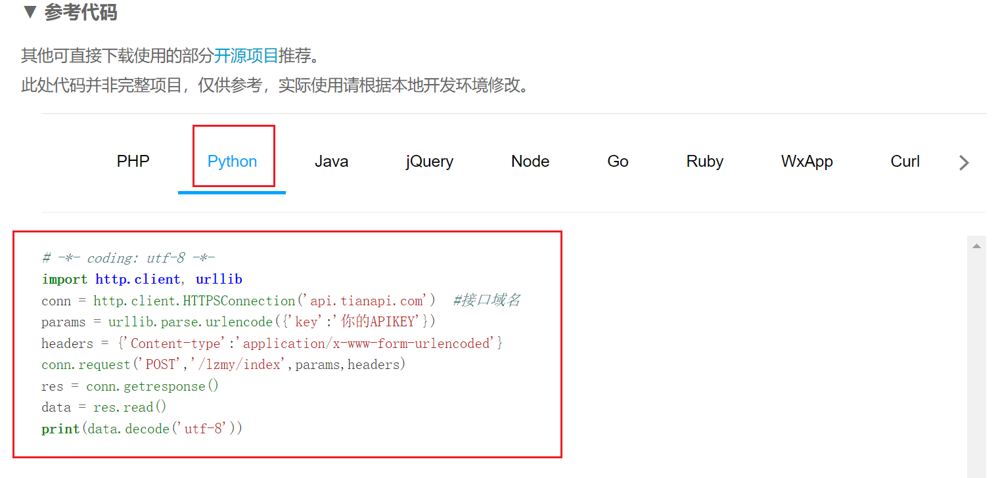

把这串代码复制下来。然后进行测试。

**强烈建议先独立开一个.PY，测试参考代码没有问题后再放进main.py！！！**

这里我们用VS Code来新建一个ceshi.py，来调试这个api接口，想省时间的可以直接复制我后面给出的源码。

把这串参考代码复制进去


然后在第4行中把`你的APIKEY`替换成我们在前面申请的key，如下图所示

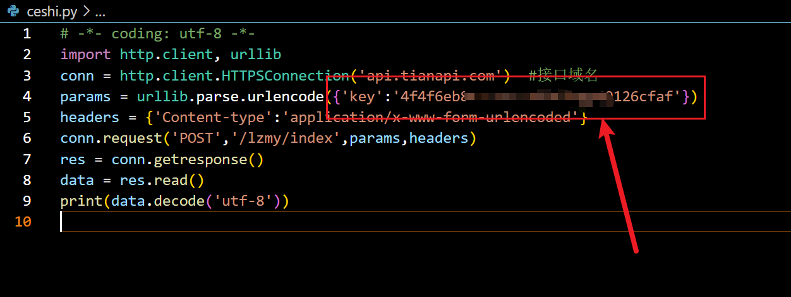

然后我们直接进行 Run Code，输出结果如下图所示


我们发现它确实成功请求到了励志古言，其最终包含翻译以及来源，并且还有很多我们不需要的东西，我们只需要名言就行了，也就是只要提取到"saying"的值就行了

由于api返回的格式为json格式，我们需要把它转换成字典格式，这里需要引用json库，在代码最前面加入 import json，并且加入一句`data = json.loads(data)`将它转换成字典格式，


然后我们提取"saying"，通过观察之前的输出结果，我们很容易发现，"saying"被放在一个字典里面，然后这个字典又被放在了列表里面，这个列表又被作为最外层字典键"newslist"的值。所以我们通过下标方式提取：

`data["newslist"][0]["saying"]`

如下图所示：


这次再运行Run Code，我们会发现它已经输出正常了：


这里我把源代码贴出来，你们加入自己的KEY，可以自行测试：

```
# -*- coding: utf-8 -*-
import http.client, urllib
import json      #引入json库
conn = http.client.HTTPSConnection('api.tianapi.com')  #接口域名
params = urllib.parse.urlencode({'key':'在这里填入你自己的KEY'})
headers = {'Content-type':'application/x-www-form-urlencoded'}
conn.request('POST','/lzmy/index',params,headers)
res = conn.getresponse()
data = res.read()
data = json.loads(data)  #转换成字典
print (data["newslist"][0]["saying"])
```

## 3.3 将对接好的api放入主程序

首先我们观察主程序main.py

发现有几个主要流程

1. 编写获取api的函数
2. 将函数返回值赋予给自定义变量
3. 将变量作为参数放进post

总体比较简单，我这里直接给出我编写的函数

```
def lizhi():
    conn = http.client.HTTPSConnection('api.tianapi.com')  #接口域名
    params = urllib.parse.urlencode({'key':'在这里填入你自己的KEY'})
    headers = {'Content-type':'application/x-www-form-urlencoded'}
    conn.request('POST','/lzmy/index',params,headers)
    res = conn.getresponse()
    data = res.read()
    data = json.loads(data)
    return data["newslist"][0]["saying"]
```

同时要记得在main.py开头位置引入我们需要的库

```
import http.client, urllib
import json
```

如图所示


然后拉到最底下，把返回值赋予给变量lizhi

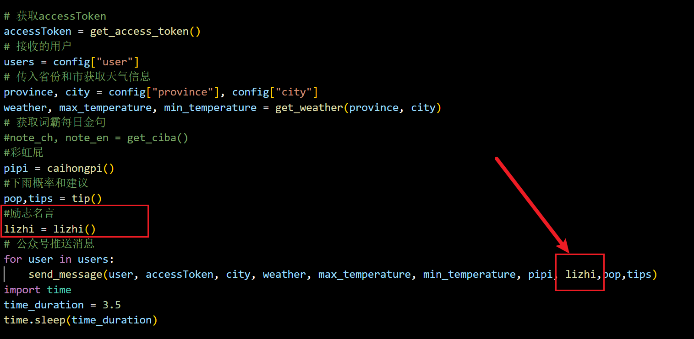

同时记得把lizhi这个变量加入send_message这个函数里面。

然后我们找到推送消息这一行，也要把它加入send_message里面

我这里多了一些pipi,pop,tip，都不用管，这个是我自己加入的其他的api，你们只需要加入一个lizhi就好啦。加多了会报错，记得直接在末尾加上就好。

最后，我们找到打包post的函数

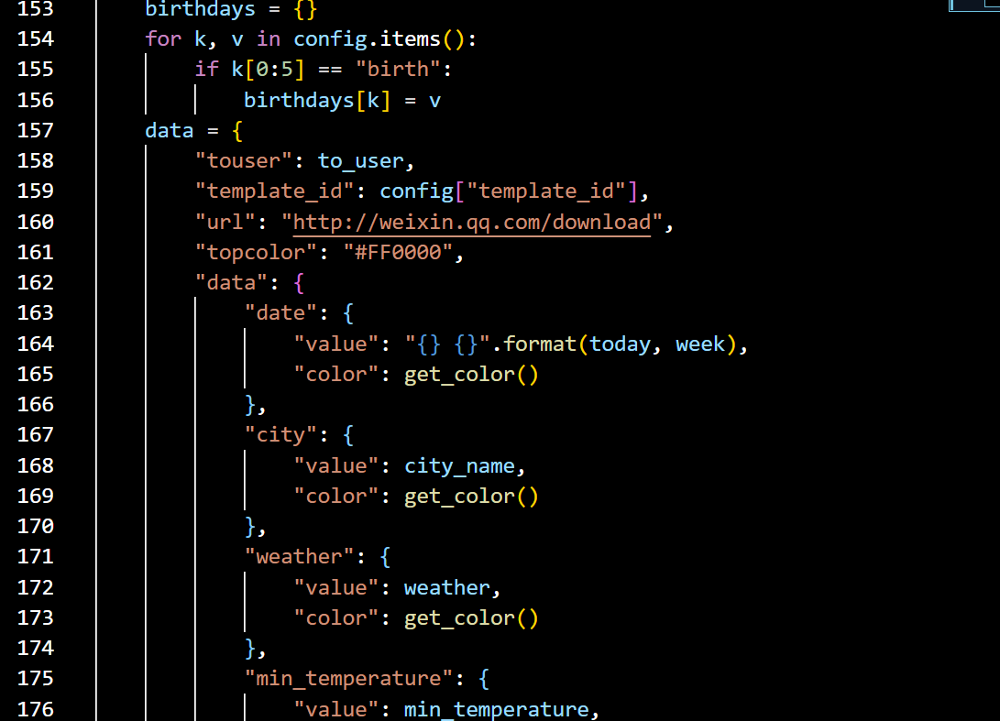

在这个位置，直接在最底下，仿照上面，加入一个lizhi


记得放在最后面的话，花括号后面不要逗号。

至此，api接入已经全部完成。

在保证消息模板中有{{lizhi.DATA}}，并且config.txt文件填写无误的情况下就可以运行了！

## 3.4 运行程序

```commandline
直接双击文件 main.py 即可
```

注：如果要在VS CODE中运行，需要先在vs code中打开相应的文件夹

# 五、附挂服务器（家用电脑也可以）自动任务教程

注意：没有服务器的话，用家用电脑也可以，但是在电脑关机的情况下，无法进行自动任务。

## 4.1首先你需要一台云服务器

`我自己用的是腾讯云服务器，购买地址为:https://cloud.tencent.com/`

购买之后安装系统镜像，我这里选择的是Windows servers 2012 R2

刚开始安装系统会要求你设置VNC登录密码，如果忘记了需要重置密码

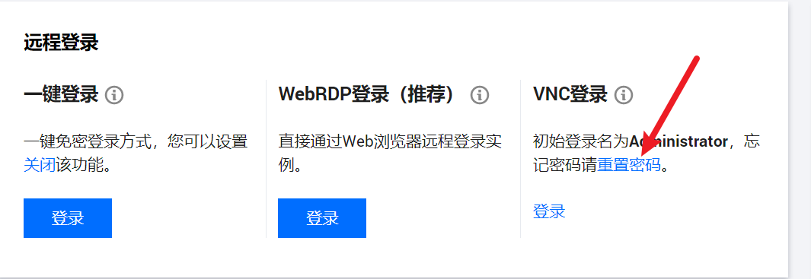

在购买成功服务器的同时你还会获得一个公网ip


安装好后首先要做的事情是用自己的电脑连接上服务器

## 4.2 连接服务器


直接在自己的电脑上搜索远程电脑连接工具

然后计算机栏填你刚刚申请的公网ip；

用户名填**Administrator**

密码填你刚刚在VNC设置的密码

填好后就能登录我们的服务器拉

## 4.3 安装python

在你的远程服务器上也需要安装python和request包还有配置系统变量，可以直接在服务器中打开浏览器安装，和在自己电脑上操作一模一样

官方网站: https://www.python.org/getit/

**记住在安装后需要配置系统环境PATH,具体教程网上可搜**

## 4.4 安装requests包

打开cmd，执行以下命令

```commandline
pip3 install requests
```

## 4.5 设置定时任务

你可以直接把你电脑里面的代码文件夹都复制进去，因为windows定时任务不能直接执行.py文件，所以我们需要创建一个.bat文件，首先我们要在服务器上创建一个文本文件（记得要放在与main.py同一个文件夹里面），在里面输入

`python main.py`

(通过呆瓜版完成的同学可以直接使用main.exe，不用创建.bat)


然后进行重命名，我这里重命名为run.bat文件。该文件已经同步上传github和码云，可以直接下载。


然后我们就可以开心的设置定时任务啦！

在服务器上搜索`任务计划程序`


点击`创建基本任务`

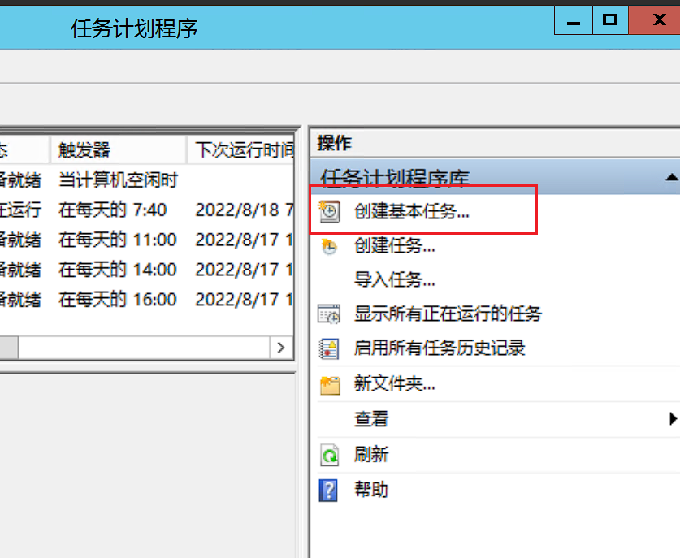

名称就直接填`微信推送`就行

点击`下一步`，选择`每天`


这里填你每天想要推送的时间，我这里选的是早上七点四十


选择`启动程序`


然后在`程序或脚本`这里填入你运行代码的run.bat文件

记住`起始于`也要填，填你放run.bat的文件夹

文件夹地址可以直接复制


这一步完成后直接点击完成

但是还没有完，我们还需要设置启动程序权限


点击刚刚创建任务的属性


勾选`不管用户是否登录都要运行`和`使用最高权限运行`，配置选择你的服务器配置（用电脑的选用自己电脑配置）

全部完成后点击确定，然后输入VNC密码就可以啦！

全部完成~

# 六、后言&捐赠渠道

感谢大家一直以来的支持，当时没想到会有这么多人关注这个项目，我在这次项目中也学到了很多，所有代码都全部开源，大家可以自行学习修改，拓展。

开源不易，如果本教程对你有帮助，可以考虑给作者`捐款`，激励作者继续更新迭代，感谢支持


